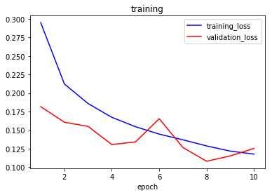
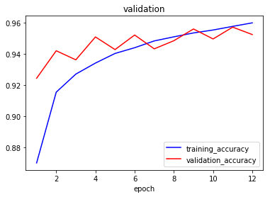

<h3 align="center">
  
</h3>

# Histopathologic Cancer Detector

Python Jupyter Notebook leveraging **Transfer Learning**  and **Convolutional Neural Networks** implemented with **Keras**. 

Part of the [Kaggle competition](https://www.kaggle.com/c/histopathologic-cancer-detection). 

## Data

**Dataset:** [Link](https://www.kaggle.com/c/histopathologic-cancer-detection/data)

**Description:** Binary classification whether a given histopathologic image contains a tumor or not.

**Training:** 153k (0.9) images

**Validation:** 17k (0.1) images

**Testing:** 57.5k images

## Model
	__________________________________________________________________________________________________
	Layer (type)                    Output Shape         Param #     Connected to                     
	==================================================================================================
	input_1 (InputLayer)            (None, 96, 96, 3)    0                                            
	__________________________________________________________________________________________________
	xception (Model)                (None, 3, 3, 2048)   20861480    input_1[0][0]                    
	__________________________________________________________________________________________________
	NASNet (Model)                  (None, 3, 3, 1056)   4269716     input_1[0][0]                    
	__________________________________________________________________________________________________
	global_average_pooling2d_1 (Glo (None, 2048)         0           xception[1][0]                   
	__________________________________________________________________________________________________
	global_average_pooling2d_2 (Glo (None, 1056)         0           NASNet[1][0]                     
	__________________________________________________________________________________________________
	concatenate_5 (Concatenate)     (None, 3104)         0           global_average_pooling2d_1[0][0] 
	                                                                 global_average_pooling2d_2[0][0] 
	__________________________________________________________________________________________________
	dropout_1 (Dropout)             (None, 3104)         0           concatenate_5[0][0]              
	__________________________________________________________________________________________________
	dense_1 (Dense)                 (None, 1)            3105        dropout_1[0][0]                  
	==================================================================================================
	Total params: 25,134,301
	Trainable params: 25,043,035
	Non-trainable params: 91,266
	__________________________________________________________________________________________________

## Training

<h3>
  
</h3>

<h3>
  
</h3>

## Results

Kaggle score: **0.9550**

